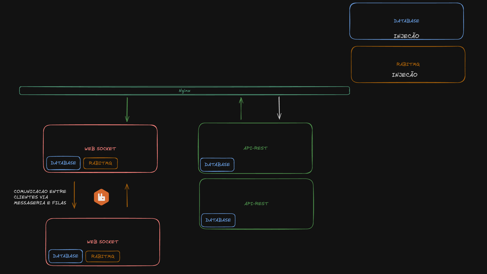

  

<h1 align="center">messox-server</h1>

  🛰️ Servidor modular para o <strong>messox-app</strong> 
  API REST • WebSocket • PostgreSQL • RabbitMQ • Nginx

---

## ✨ Sobre o projeto

**messox-server** é o coração do aplicativo de mensagens open source [messox-app](https://github.com/JoaooffZz/messox-app).  
Projetado com micro-serviços:
- Distribuição de carga: **Nginx**
- Comunicação: **WebSocket + RabbitMQ**
- Escalabilidade e velocidade: **API REST + PostgreSQL**

O foco principal do projeto é oferecer **liberdade, personalização** e **controle total** aos desenvolvedores que desejam um servidor **escalável, robusto, modular e customizável**.

> Crie, personalize e hospede seu próprio servidor de mensagens — livre de qualquer órgão ou entidade centralizadora.

---

## 🧩 Tecnologias & Infraestrutura

- **Linguagem:** Go (Golang)
- **API REST:** [Gin](https://gin-gonic.com/)
- **WebSocket:** [Gorilla WebSocket](https://gorilla.github.io/)
- **Banco de Dados:** PostgreSQL
- **Arquitetura:** Load Balancer - Microserviços - Ports and Adapters

---

## 🎯 Objetivos

- Oferecer um servidor **customizável e robusto**
- Permitir que **qualquer usuário** possa:
  - Subir seu próprio servidor local ou remoto
  - Personalizar módulos com facilidade
  - Utilizar uma documentação clara para autohospedagem
- Ser uma alternativa **descentralizada** e **open source** aos grandes serviços de mensagem atuais

---

## 🛠️ Em breve

- [ ] Documentação completa com exemplos
- [ ] Módulo de canais ONE TO ONE
- [ ] Integração com Nginx
- [ ] Integração com PostgreSQL
- [ ] Integração com RabbitMQ
- [ ] Rotas principais da API

## 📚 Docs

## Arquitetura

  

